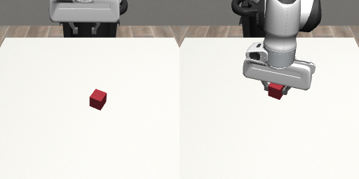
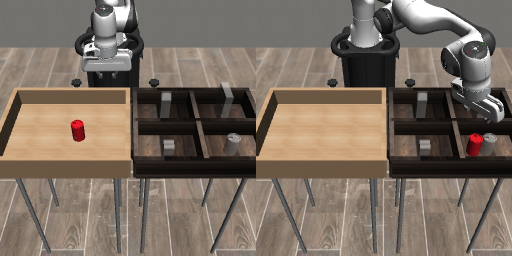
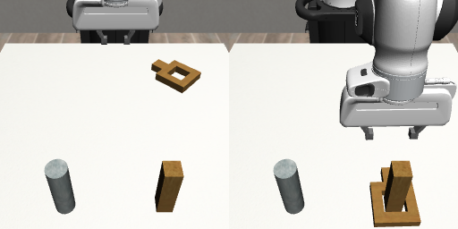
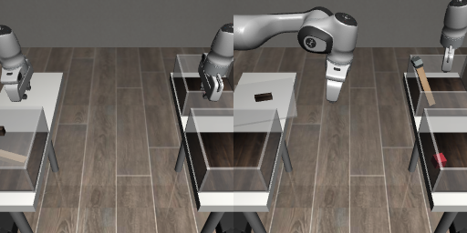
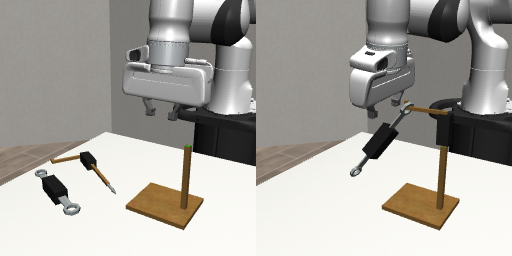

# Tasks

The five robomimic simulation tasks as POMDPs, made with `jax_pomdps.make("robomimic.env:<name>")`. Every task
is robosuite's: its scene, robots, controller, observations, reward, and success check, re-expressed in JAX on
MuJoCo Warp. The quotes are robosuite v1.5's docstrings; the images show the first and last state of each
task's first released demonstration.

Names follow [jax_gym](https://github.com/mishmish66/jax-gym)'s scheme: dashes join words, and slashes add
variants, the reward first and then the observation. Each task `<task>` has a dense reward and `<task>/sparse`
the datasets' sparse reward. Each such `name` observes robomimic's low-dim observations, and also exists as

- `name/prp`, observing each robot's proprioception alone, as one vector;
- `name/pix`, observing images alone: one uint8 image of the cameras of robomimic's image datasets, stacked
  along channels in this order: `agentview` and `robot0_eye_in_hand` at 84×84 for Lift, Can, and Square,
  `shouldercamera0`, `shouldercamera1`, `robot0_eye_in_hand`, and `robot1_eye_in_hand` at 84×84 for Transport,
  and `sideview` and `robot0_eye_in_hand` at 240×240 for Tool Hang; `height` and `width` resize them;
- `name/pix-prp`, observing `{"pixels": ..., "prp": ...}`, those images and the proprioception vector;
- `name/mkv`, observing one vector close enough to the Markov state that a policy of the current observation
  alone can solve the task: the task's object observation of the current state, the proprioception, `qpos`
  and `qvel` of everything but parked objects, each gripper's open / close state, and the joint positions the
  arms' controllers pull their nullspace toward (the arms' positions at reset). The next observation, reward,
  and done follow from it and the action; it leaves out only the solver's warm start, as MuJoCo's physics state
  does.

`RobomimicPOMDP(task, observation=..., reward=...)` builds the same POMDPs: `observation` is `"low-dim"`,
`"prp"`, `"mkv"`, or `Pixels(cameras, height, width, proprio)` for any cameras, and `reward` is `"dense"` (the
default) or `"sparse"`.

All tasks share these conventions:

- **Actions** are robosuite's OSC_POSE deltas for each arm, in the world frame, followed by its gripper
  command: 6 values in [-1, 1] scaled to ±5 cm and ±0.5 rad, and one open/close value; Transport has two arms,
  so 14 values.
- **Control** runs at 20 Hz, robosuite's rate for the robomimic datasets: each step is 10 substeps of 5 ms,
  and the OSC controller recomputes the arm torques at every substep.
- **Low-dim observations** are a dictionary keyed like robosuite's: per robot, `robot<i>_joint_pos`, `_joint_pos_cos`,
  `_joint_pos_sin`, `_joint_vel`, `_eef_pos`, `_eef_quat`, `_eef_quat_site`, `_gripper_qpos`, and
  `_gripper_qvel`, and `object`, the task's object observations, in robosuite's order. Quaternions are
  (x, y, z, w).
- **Dense reward** is 0 on success and otherwise -1 plus half the task's progress in [0, 1]. For each object
  the task moves, progress is 0.2 for reaching it, 0.2 for holding it, and 0.6 for carrying it to its goal; an
  object released at its goal counts as held. Lift, Can, Square, and Transport scale progress by how upright the
  grippers point, as their demonstrations hold them. Every step before success costs at least 0.5, so
  succeeding sooner always pays.
- **Sparse reward** (`/sparse`) is the datasets' reward: 1 when the task succeeds, 0 otherwise (robosuite's
  normalized sparse reward with `reward_scale` 1).
- **Episodes** end on success (`done`); there is no time limit.
- **Initial states** are drawn from 1024 states sampled from robosuite's reset distribution.

## `lift`

> This class corresponds to the lifting task for a single robot arm.
>
> Sparse un-normalized reward: a discrete reward of 2.25 is provided if the cube is lifted
>
> — robosuite v1.5, `robosuite/environments/manipulation/lift.py`

A Panda arm lifts a cube from a table. **Success**: the cube's center is more than 4 cm above the table top.
**Object observation** (10): the cube's position and quaternion, and its position relative to the gripper.
**Dense reward**: carrying is raising the cube to the success height.

## `can`

> Easier version of task - place one can into its bin.
>
> Sparse un-normalized reward: a discrete reward of 1.0 per object if it is placed in its correct bin
>
> — robosuite v1.5, `robosuite/environments/manipulation/pick_place.py` (`PickPlaceCan`)

A Panda arm moves a can from one bin into its compartment of the other. **Success**: the can is inside its
compartment, below the bin's rim, and the gripper has let go of it. **Object observation** (14): the can's
position and quaternion relative to the gripper, then in the world.
**Dense reward**: carrying is lifting the can 20 cm above the bin floor, moving it over its compartment, and lowering
it in; a can released over its compartment counts as held.

## `square`

> Easier version of task - place one square nut into its peg.
>
> Sparse un-normalized reward: a discrete reward of 1.0 per nut if it is placed around its correct peg
>
> — robosuite v1.5, `robosuite/environments/manipulation/nut_assembly.py` (`NutAssemblySquare`)

A Panda arm picks up a square nut by its handle and slides it down over a square peg. **Success**: the nut is
within 3 cm of the peg horizontally, low on the peg, and the gripper has let go of it. **Object observation**
(14): the nut's position and quaternion relative to the gripper, then in the world.
**Dense reward**: carrying is lifting the nut 18 cm above the table, moving it over the peg, and lowering it
down the peg; a nut released over the peg counts as held.

## `transport`

> This class corresponds to the transport task for two robot arms, requiring a payload to be transported from
> an initial bin into a target bin, while removing trash from the target bin to a trash bin.
>
> Sparse un-normalized reward: a discrete reward of 1.0 is provided when the payload is in the target bin and
> the trash is in the trash bin
>
> — robosuite v1.5, `robosuite/environments/manipulation/two_arm_transport.py`

Two Panda arms facing each other: one lifts a lid and takes a hammer out of its bin and hands it over; the
other clears a piece of trash out of the target bin and places the hammer in it. **Success**: the hammer
touches the target bin's base and the trash touches the trash bin's base. **Object observation** (41): the
poses of the hammer, the trash, and the lid handle, the bin positions, both contact flags, and the objects'
positions relative to the grippers.
**Dense reward**: 0.3 for the trash, carried over the trash bin's walls and dropped in; 0.15 for the lid, slid off
the start bin until at most 6 cm of it covers the bin; and, once the lid is off, 0.55 for the payload, carried over the target bin's walls and lowered in.
Either arm counts for reaching and holding, so the payload can pass between them.

## `tool-hang`

> This class corresponds to the tool hang task for a single robot arm.
>
> Check if tool is hung on frame correctly and frame is assembled coorectly as well.
>
> — robosuite v1.5, `robosuite/environments/manipulation/tool_hang.py`

A Panda arm inserts an L-shaped frame into a stand, then hangs a wrench-like tool on the frame's hook by its
ring. The tightest task: the frame and the ring leave millimeters of clearance. **Success**: the frame stands
upright in the stand's hole, and the tool hangs from the hook without touching the gripper. **Object
observation** (44): the poses of the stand, the frame's hook, and the tool, each relative to the gripper and in
the world, and whether the frame is assembled and the tool is on it.
**Dense reward**: half for the frame: reaching its grip, holding it, turning its post upright, lifting its tip over
the stand's walls, and lowering it into the slot between them; and, once the frame stands, half for the tool:
reaching its grip, holding it, and bringing its hole onto the end of the frame's hook. A frame released upright
over the slot, or a tool released at the hook's end, counts as held. The gripper may point sideways, as the
demonstrations hold it.
